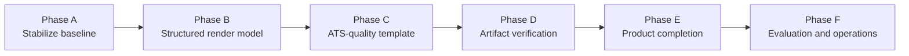

# Export Quality and Release Readiness Plan

**Status:** Active

**Owner:** Resume Tweak project

**Created:** 2026-09-11

**Purpose:** Track the work required to make generated resumes recruiter-quality while preserving factual provenance, ATS safety, reliable version management, and a testable release process.

> Update this document as each phase is completed. Mark individual acceptance criteria as complete only after the associated automated checks pass and the change has been manually reviewed where required.

---

## 1. Current Baseline

The application has completed the core workflow through **Phase 3**:

- DOCX and text-based PDF ingestion paths exist.
- Users can review and approve a source-backed factual profile.
- The multi-agent workflow creates an evidence-grounded tailored draft.
- ATS and readability reviewers run before a final editor produces approved content.
- DOCX-first export, LibreOffice PDF conversion, local version metadata, and downloads are implemented at a basic level.

### Current limitations

- The export generator flattens resume content into section-level bullets.
- Contact details are not rendered in generated documents.
- Experience entries do not retain employer, title, date, or achievement hierarchy.
- The final `markdown` field is not faithfully used as the rendering source.
- Document validation is limited to PDF text presence; DOCX and visual/structural validation are missing.
- The UI creates only job-specific versions.
- The versioning subsystem needs error handling, atomic persistence, runtime validation, and complete E2E coverage.
- Phase 5 evaluation and operational readiness work has not started.

### Latest validation result

| Check | Result |
|---|---|
| API unit tests | Passed: 12 tests across 5 suites |
| API E2E tests | Passed: 10 tests across 2 suites |
| API production build | Passed |
| Web production build | Passed |
| PDF test configuration | E2E tests set `NODE_OPTIONS=--experimental-vm-modules` so `pdf-parse` can initialize its PDF.js worker under Jest. |

---

## 2. Principles and Non-Negotiable Rules

1. **Truthfulness first.** Every material resume statement must remain linked to approved canonical evidence.
2. **DOCX is the primary export artifact.** PDF is rendered only from the final generated DOCX.
3. **ATS-safe output remains separate from any future polished template.** The initial template must stay single-column and avoid tables, text boxes, graphics, and vital header/footer content.
4. **The approved structured render model is the export source of truth.** Do not generate a simplified document that drops approved content or hierarchy.
5. **Files are downloadable only after explicit user approval.**
6. **Automated verification accompanies every export.** Verification must cover content, required structure, and artifact availability.
7. **Sensitive resume data stays local except for the necessary Foundry tailoring requests.** Do not add raw resume content to logs.

---

## 3. Delivery Roadmap



---

## Phase A — Stabilize the Existing Workflow

**Status:** Complete (2026-09-11)

**Goal:** Restore a green baseline and make the current export/version workflow safe to test and operate before changing the document model.

### Scope

1. Fix the valid text-based PDF ingestion E2E regression. — **Completed**
2. Run and restore all existing checks: — **Completed**
   - API unit tests;
   - API E2E tests;
   - API production build;
   - web production build.
3. Add export/version HTTP E2E coverage: — **Completed for the primary happy path**
   - approved run → version creation;
   - version listing;
   - DOCX download;
   - PDF download;
   - factual-profile reuse.
4. Validate download formats at runtime; reject anything other than `docx` or `pdf` with `400`. — **Completed**
5. Check artifact existence before download and return `404` for missing files. — **Completed**
6. Improve version persistence: — **Completed**
   - generate into a temporary directory;
   - verify artifacts before publishing;
   - atomically move completed output into the final directory;
   - clean up temporary/incomplete artifacts on all failures;
   - update the manifest atomically.
7. Treat a corrupt manifest as a recoverable error, not an empty version list. — **Completed**
8. Align `ResumeVersionMetadata` TypeScript types, persisted metadata, and JSON schema; validate metadata before persistence. — **Completed**

### Acceptance criteria

- [x] API unit tests pass.
- [x] API E2E tests pass, including valid DOCX and text-based PDF ingestion.
- [x] API production build passes.
- [x] Web production build passes.
- [x] Version creation/list/download/source-profile E2E tests pass.
- [x] Unsupported download formats return a clear `400` response.
- [x] Registered but missing artifacts return `404`.
- [x] Failed export does not leave published artifacts, orphaned directories, or corrupt manifest records.
- [x] Persisted version metadata validates against the corrected shared schema.

---

## Phase B — Introduce a Structured Resume Render Model

**Status:** Complete (2026-09-11)

**Goal:** Replace flat claims as the document-generation input with a structured, validated representation that preserves normal resume hierarchy.

### Design decision

The document generator must no longer rebuild a flat resume from `FinalResumePackage.claims` alone. It must render an approved structured document model, with source-evidence references retained on every material content item.

### Target model

The precise contract will be designed and reviewed before implementation. It should support at least:

```text
ResumeRenderModel
  identity
    name
    headline
    email, phone, location, links
  summary
  skills[]
    category
    items[]
  experience[]
    employer
    title
    location?
    startDate/endDate?
    achievements[]
  projects[]
  education[]
  certifications[]
  additionalInformation[]
```

Each editable/generated item must retain canonical evidence references. The model must not invent fields simply because the template supports them.

### Scope

1. Design a versioned shared contract for the render model and JSON schema. — **Completed**
2. Decide whether the Final Resume Editor emits the render model directly or whether the backend derives it deterministically from approved final content. — **Backend-derived projection selected and implemented**
3. Preserve the existing canonical factual profile and evidence guardrails. — **Completed**
4. Map current profile/claim content into the structured model incrementally, beginning with identity/contact, summary, skills, experience, education, and certifications. — **Completed with persisted canonical structures**
5. Preserve a machine-readable rendering order. — **Completed**
6. Make the approved render model, rather than reconstructed Markdown or flat claims, the canonical export input. — **Completed for document generation**
7. Clarify treatment of incomplete extracted structure from DOCX/PDF imports; retain a safe fallback representation where hierarchy cannot be inferred. — **Completed with contextual sections and deterministic fallback grouping**

### Acceptance criteria

- [x] A shared, schema-validated `ResumeRenderModel` contract exists.
- [x] The final workflow output includes a validated render model.
- [x] Identity/contact content is rendered in the document body when supported by approved evidence.
- [x] Experience supports role-level hierarchy and nested achievements where recognizable role headings exist.
- [x] Skills, education, and certifications can render in section-appropriate formats.
- [x] Every rendered material item has valid canonical evidence references.
- [x] The export no longer silently discards approved content structure in the supported render model.
- [x] Contract and transformation unit tests cover complete and partially structured resumes.
- [x] Extracted source segments persist section and heading metadata for later review and rendering.
- [x] Canonical profiles persist reviewable identity, skill-group, experience-entry, education-entry, and certification structures.
- [x] Users can correct a claim's section during factual-profile review; approval rebuilds canonical structures from approved claims.
- [x] Render-model projection prefers approved canonical structures and falls back safely for incomplete/legacy profiles.
- [x] Shared contract builds validate every JSON Schema file.
- [x] Final candidate-facing claims and legacy render models are deduplicated by normalized section/text before export.

### Phase B validation

- API unit tests: **27 passed** across 8 suites.
- API E2E tests: **10 passed** across 2 suites.
- Shared contracts build, API build, and web build: **passed**.
- PDF verification compares exact rendered-model content, including PDF bullet and typography normalization, so valid version exports do not fail against stale flat claims.

---

## Phase C — Build the ATS-Quality DOCX and PDF Template

**Status:** Not started

**Goal:** Generate a recruiter-readable DOCX without compromising ATS compatibility, then render a matching PDF through the existing DOCX-first flow.

### Scope

1. Add a dedicated document layout implementation based on `ResumeRenderModel`.
2. Render a body-level identity/contact block:
   - candidate name;
   - headline when supported;
   - email, phone, location, and links when approved.
3. Render conventional sections using standard headings:
   - Summary;
   - Skills;
   - Experience;
   - Education;
   - Certifications.
4. Render experience entries with clear employer/title/date hierarchy and achievement bullets.
5. Render skills compactly without tables or multi-column layout.
6. Configure explicit typography, margins, indentation, paragraph spacing, and page behavior:
   - standard font such as Arial, Calibri, or Aptos;
   - heading keep-with-next behavior;
   - predictable bullet indentation;
   - no unnecessary blank pages;
   - no content clipped at page boundaries.
7. Respect safe length preferences such as “keep to one page” as a best-effort editorial constraint, never by dropping required approved content without user-visible review.
8. Keep the output single-column and table-free.
9. Continue rendering PDF from the finalized DOCX only.

### Acceptance criteria

- [ ] Generated DOCX includes the approved identity/contact block in the body.
- [ ] Generated DOCX preserves employer/title/date/achievement hierarchy where the source supports it.
- [ ] Standard headings and simple bullets are used.
- [ ] The template contains no tables, multi-column layouts, text boxes, charts, graphics, or vital header/footer data.
- [ ] PDF conversion preserves the intended DOCX text and order.
- [ ] At least one anonymized example is manually reviewed as a recruiter-quality output before phase completion.

---

## Phase D — Add Artifact and Layout Verification

**Status:** Not started

**Goal:** Make document generation testable and prevent regressions that drop content or break ATS-safe structure.

### Scope

1. Extract text from generated DOCX and compare it with the approved render model.
2. Continue PDF text extraction and compare it with the same render model.
3. Add document-structure checks for DOCX:
   - exactly one column;
   - no tables;
   - no text boxes/drawing elements;
   - no required content in headers or footers;
   - expected standard headings;
   - non-empty body content.
4. Add content checks:
   - contact block when present in approved model;
   - required section order;
   - no dropped rendered items;
   - no duplicate content;
   - PDF/DOCX text alignment.
5. Add layout sanity checks:
   - non-zero artifact sizes;
   - PDF page count is reasonable;
   - no blank trailing page where detectable.
6. Build an anonymized golden-fixture set and require manual visual review whenever the template changes.

### Acceptance criteria

- [ ] DOCX and PDF text are both verified against the approved render model.
- [ ] Structural checks reject tables, multiple columns, text boxes, and essential header/footer content.
- [ ] Expected standard headings and approved contact details are verified.
- [ ] Regression tests detect dropped sections, missing claims, and mismatched DOCX/PDF text.
- [ ] Golden artifact checks run in CI/local test workflow where LibreOffice is available.
- [ ] A template-change checklist includes manual review of generated DOCX and PDF.

---

## Phase E — Complete Versioning and Export User Experience

**Status:** Not started

**Goal:** Finish the product workflow around the hardened export pipeline.

### Scope

1. Add UI controls to create:
   - `general` versions;
   - `targeted` versions, including required track metadata;
   - `job-specific` versions, including company metadata where applicable.
2. Display version metadata, creation date, target role, model profile, and unresolved gaps in the version browser.
3. Improve user-visible export states and errors.
4. Decide and document the meaning of **Use as source**:
   - **Option A (current/safest):** reuse the original approved factual profile;
   - **Option B (future):** use an approved tailored version as a starting content selection while retaining the factual profile as the only evidence source.
5. If Option B is approved, explicitly model it, preserve provenance, and make the UI distinction clear.
6. Add filtering/searching only if needed after the core flow is complete.

### Acceptance criteria

- [ ] UI supports all three version types and their required metadata.
- [ ] Users receive clear export progress, success, and failure feedback.
- [ ] Version browser displays complete useful metadata and working download links.
- [ ] Source reuse behavior is documented, implemented, and covered by tests.
- [ ] No version can be published before explicit final-content approval.

---

## Phase F — Evaluation, Safety, and Operational Readiness

**Status:** Not started

**Goal:** Establish repeatable quality measurement and safe maintenance for regular use.

### Scope

1. Create an anonymized evaluation dataset of resume/job-description pairs.
2. Add evaluations for:
   - factual consistency and evidence fidelity;
   - coverage of supported high-priority requirements;
   - unresolved gap preservation;
   - ATS-safe output structure;
   - document completeness;
   - recruiter readability.
3. Add regression tests for prompt, schema, model-profile, and template changes.
4. Version agent instructions, output schemas, render-model contract, and document template.
5. Require evaluation results before changing the active model profile or document template.
6. Improve operational safety:
   - redacted errors/traces;
   - predictable retry behavior for transient Foundry failures;
   - explicit user-facing failure states;
   - no raw contact data in logs.

### Acceptance criteria

- [ ] Evaluation data and repeatable evaluation command exist.
- [ ] Regressions detect unsupported skills, changed dates, dropped sections, and invalid artifacts.
- [ ] Prompt/model/template changes have recorded evaluation outcomes.
- [ ] Failure diagnostics are useful without exposing raw resume contact data.

---

## 4. Phase Completion Protocol

For every phase:

1. Update this document’s status and checkboxes as work is completed.
2. Add or update automated tests before marking a functional item complete.
3. Run relevant tests plus production builds.
4. Record any intentionally deferred work in the **Decision and Deferral Log**.
5. For document-template changes, perform and record a manual visual review using anonymized data.
6. Do not combine large model-contract, template, and persistence changes in one unverified step; land and validate them in small increments.

---

## 5. Decision and Deferral Log

| Date | Decision / deferral | Rationale | Owner / follow-up |
|---|---|---|---|
| 2026-09-08 | DOCX-first generation with LibreOffice PDF conversion | Keeps DOCX/PDF text aligned and avoids a second content-generation path. | Retain; reconsider only if conversion is unreliable. |
| 2026-09-11 | Improve the structured export model before changing PDF libraries or visual styling. | Current quality problem is primarily lost content hierarchy, not PDF conversion. | Address in Phases B and C. |
| 2026-09-11 | Keep the ATS-safe template single-column and table-free. | Preserves broad ATS compatibility. | Verify automatically in Phase D. |
| 2026-09-11 | Saved-version source reuse remains factual-profile reuse until a tailored-content mode is explicitly designed. | Avoids treating generated wording as new factual evidence. | Decide in Phase E. |
| 2026-09-11 | E2E PDF ingestion uses a LibreOffice-generated PDF from the anonymized DOCX fixture. | The minimal hand-crafted PDF fixture was parser-compatible in isolation but PDF.js worker initialization under Jest requires VM-module support; testing a realistic generated PDF better represents supported input. | Keep `NODE_OPTIONS=--experimental-vm-modules` in the API E2E script until the PDF parser/test-runner integration is upgraded. |
| 2026-09-11 | Version publication uses a temporary output directory plus atomic renames. | Prevents incomplete artifacts from appearing as published versions when generation or persistence fails. | Covered by `version.service.spec.ts`; Phase A complete. |
| 2026-09-11 | Functional validation is green; repository lint still reports pre-existing unsafe test typing and async callback issues outside the Phase A service. | Phase A acceptance is behavior/build focused; existing lint debt should be handled separately rather than mixed into export reliability work. | Track separately. |
| 2026-09-11 | Ingestion now carries active section and heading metadata onto source segments and claims. | Contextual classification keeps summaries, skills, experience, education, and certifications together and prevents role lines from being misclassified as contact data. | Extend this into explicit role/education/skill entry structures in the remaining Phase B work. |
| 2026-09-11 | PDF verification normalizes LibreOffice discretionary line-wrap hyphenation before checking rendered content. | PDF extraction can return `service-\ndecomposition` or `high-\nthroughput`; these are the same rendered words as the approved DOCX content and must not block version creation. | Covered by unit regression and a real approved-run export. |
| 2026-09-11 | Candidate-facing duplicate lines are removed before persistence and export. | A real tailored run contained repeated final claims and repeated legacy render-model items; this is content integrity, not a PDF layout artifact. | Guard applies to new tailoring results and legacy saved runs; Phase B complete. |

---

## 6. Immediate Next Action

Continue Phase B by adding explicit reviewable experience, education, and skill-group structures to the canonical profile, then use those structures to remove remaining heuristic grouping from export.
