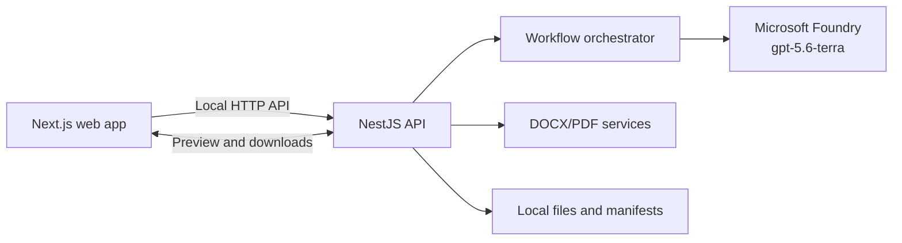
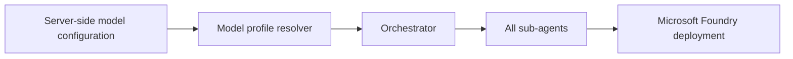
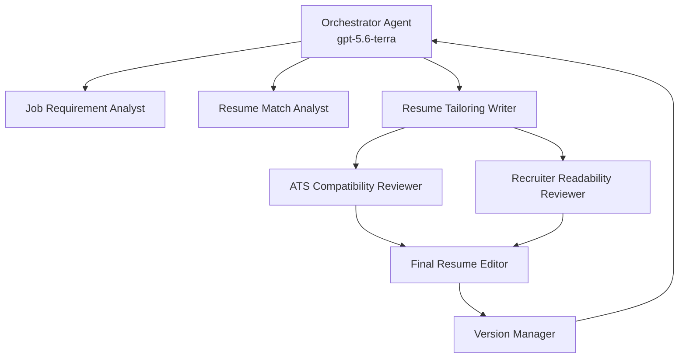
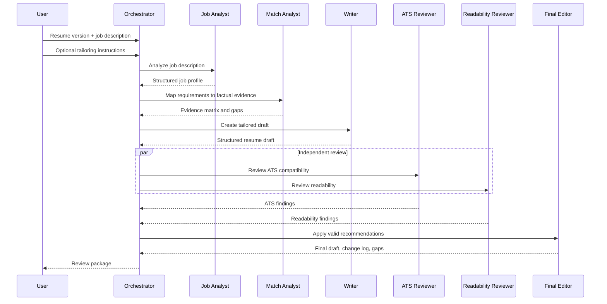
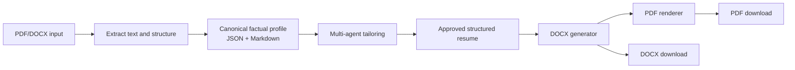

# Multi-Agent Resume Tailoring System — Implementation Plan

## 1. Purpose

Build a private, local-first web application that tailors a factual base resume to a pasted job description. The application must:

- accept a base resume in **DOCX** or **PDF** format;
- create recruiter-readable, ATS-compatible tailored resumes;
- produce downloadable **DOCX** and **PDF** files;
- retain a reusable **general** resume plus targeted role-based versions;
- never invent experience, skills, qualifications, dates, employers, or achievements;
- use the Microsoft Foundry **`gpt-5.6-terra`** deployment for **every agent**.

This document is the implementation reference for the application.

## Implementation Status

**Current phase: Phase 2 — Initial Tailoring Workflow**

**Status as of 2026-09-09: Phase 1 DOCX-first exit complete**

The foundation work and the agreed DOCX-first Phase 1 exit slice are complete.
The application can now create a user-reviewed, approved canonical factual profile
that is safe to use as the evidence source for Phase 2 tailoring.

### Completed so far

- pnpm TypeScript workspace and monorepo structure
- NestJS API foundation with Swagger/OpenAPI setup
- minimal Next.js shell and local upload/review page
- server-side config and model-profile wiring
- evidence guard for unsupported claims
- anonymized fixture data for job description and resume profile
- Foundry connectivity and smoke-test validation against `gpt-5.6-terra`
- DOCX upload API endpoint with file-size/type validation
- DOCX text extraction into a canonical profile draft
- stored source segments and claim-to-source traceability
- local persistence of uploaded source files and canonical profile JSON
- browser upload flow to preview, edit, remove, and approve extracted claims
- claim section classification for contact, summary, skills, experience, education, and certifications
- explicit draft/approved profile lifecycle with persisted approval timestamp
- valid anonymized DOCX fixture
- HTTP end-to-end tests for upload, retrieval, approval, and malformed-document rejection

### Validated work

- NestJS API build passes.
- Next.js web app build passes.
- malformed DOCX upload fails with a clean 400 response rather than a 500.
- valid DOCX upload, profile retrieval, and approval complete through the HTTP API.
- approval retains source evidence while allowing reviewer wording corrections and claim removal.
- shared contracts, NestJS API, and Next.js web app all build successfully.
- Phase 1 HTTP end-to-end suite passes: 4 tests.

### Deferred Phase 1 enhancements

The following items are intentionally deferred and do **not** block Phase 2,
which will consume the approved DOCX-first canonical profile:

- text-based PDF extraction
- OCR abstraction and mandatory validation for scanned PDFs
- richer section-specific parsing beyond deterministic heading classification
- complete source/version manifest structure for later version-management phases

---

### Phase 1 working status

**Implemented scope:** DOCX upload, source extraction, claim/source traceability,
section classification, reviewer edits/removals, explicit approval, local persistence,
and HTTP end-to-end coverage.

**Phase 2 entry condition:** satisfied. Tailoring must accept only a profile whose
`status` is `approved`.

---

## How to Use This Plan

Use the document in this order during development:

1. Start with **Confirmed Decisions**, **Product Rules**, and **Technical Architecture**.
2. Build and test the NestJS backend before feature-complete frontend work; do not skip the factual-profile and approval stages.
3. Treat the **Data Contracts and Guardrails** as non-negotiable rules for every agent and API.
4. Use **Definition of Done** to decide whether the first release is complete.

### First release in one page

The user uploads a resume, checks the extracted facts, pastes a job description and optional instructions, reviews an AI-tailored draft, approves it, then downloads matching ATS-safe DOCX and PDF files. Every agent call uses `gpt-5.6-terra`; no agent may invent facts.

### Development order

Use a **backend-first** approach:

1. Build NestJS modules, local persistence, document generation, Foundry integration, and automated API tests.
2. Publish and stabilize the OpenAPI contract.
3. Build the Next.js user interface against the stable API contract.

This is the recommended approach. It makes the multi-agent workflow testable independently from the UI and prevents the frontend from defining an unstable backend API.

---

## 2. Confirmed Architecture Decisions

| Area | Decision |
|---|---|
| Application type | Private local web application |
| AI host | Microsoft Foundry |
| Foundry project | `bhavik4748-foundry-test` (West US) |
| Initial model for all agents | Deployment `gpt-5.6-terra` |
| Model selection | Central, server-side configuration; no hard-coded deployment names in agents |
| Agent pattern | Orchestrator plus specialist sub-agents |
| Frontend | Next.js |
| Backend | NestJS |
| Input | Base resume in PDF/DOCX and pasted job description |
| Canonical format | Structured resume JSON with a Markdown rendering |
| Output | ATS-safe DOCX and PDF; optional polished DOCX/PDF later |
| Storage for initial release | Local workspace files only |
| Cloud persistence | Not in initial release |

> **Initial model policy:** Every model call in the first release uses `gpt-5.6-terra`. Model selection must be centrally configurable so a future approved deployment change does not require editing each agent. Do not add automatic model routing in the first release.

> **Recommended stack:** Next.js and NestJS are a strong fit. Next.js provides the local web UI, file-upload experience, document previews, and download flow. NestJS owns the authenticated server-side Foundry calls, document parsing/generation, long-running workflow orchestration, validation, and local persistence. Do not call Foundry directly from the browser or expose Foundry credentials to the frontend.

---

## 3. Technical Architecture

### 3.1 Why Next.js + NestJS

Use a TypeScript monorepo with a clear browser/server boundary:

| Layer | Technology | Responsibilities |
|---|---|---|
| Web application | Next.js | Upload, job-description form, additional-instructions field, resume/version selection, review, previews, and downloads |
| API and workflow service | NestJS | Authentication boundary, validation, Foundry calls, multi-agent orchestration, document parsing, document generation, local file access |
| Shared package | TypeScript + JSON Schema | Request/response DTOs, agent contracts, validation rules, and shared domain types |
| Local persistence | Files + JSON manifests | Uploaded originals, canonical profiles, generated files, review reports, and version metadata |
| AI service | Microsoft Foundry | All agent inference through `gpt-5.6-terra` |



### 3.2 Backend module boundaries

Keep the NestJS backend organized by responsibility:

- `resumes`: upload, extraction, canonical-profile review, and base-resume lifecycle.
- `tailoring`: tailoring requests, additional instructions, orchestration, and run status.
- `agents`: Foundry client, prompts, JSON-schema validation, retries, and agent execution.
- `model-config`: server-side model profiles, active-model selection, startup validation, and configuration audit metadata.
- `documents`: ATS DOCX creation, PDF rendering, output verification, and downloads.
- `versions`: general/targeted/job-specific version metadata and local manifest updates.
- `storage`: safe local paths, file persistence, and cleanup of temporary artifacts.

### 3.3 Security boundary

- The browser communicates only with NestJS.
- NestJS holds Foundry configuration and credentials in server-only environment variables.
- The Next.js application must not contain Foundry endpoints, API keys, or connection strings.
- Validate file types, file sizes, and all API payloads at the NestJS boundary.

### 3.4 API documentation and testing

The NestJS API must publish an OpenAPI specification and local Swagger UI. This makes every endpoint testable before the Next.js user interface is built.

| Tool | Purpose |
|---|---|
| Swagger UI | Manual, interactive API testing and endpoint documentation |
| OpenAPI JSON | API source of truth; later used to generate or validate a typed Next.js client |
| Unit tests | Parsers, validators, services, version logic, and document-generation functions |
| Integration tests | NestJS modules with validation, temporary local storage, and mocked Foundry responses |
| End-to-end API tests | HTTP-level workflows: upload, tailoring run, approval, and download |
| Contract tests | Verify endpoint responses match OpenAPI DTOs and schemas |

Recommended local development endpoints:

```text
GET  /api/health        # API and dependency health
GET  /api/docs          # Swagger UI; local/development only
GET  /api/openapi.json  # Machine-readable OpenAPI contract
```

Swagger UI must be disabled or access-controlled outside local development. It must not expose credentials, private Foundry configuration, or personal-resume data in examples.

#### Manual backend test flow

1. Upload an anonymized test DOCX/PDF through Swagger UI.
2. Retrieve and validate the canonical profile.
3. Start a tailoring run with a job description and optional `additionalInstructions`.
4. Poll the tailoring-run status endpoint until it completes.
5. Inspect the evidence matrix, review reports, final draft, gaps, and change log.
6. Approve the run.
7. Download and inspect the generated DOCX and PDF.

Use anonymized fixtures for automated and Swagger testing. Do not commit a personal resume to the repository.

### 3.5 Configurable model design

Keep model configuration in one server-side location. Every agent receives a resolved `ModelProfile` from the backend; no prompt, sub-agent, or frontend component may embed a deployment name.



Suggested environment configuration for the first release:

```text
FOUNDRY_PROJECT_ENDPOINT=<server-side Foundry project endpoint>
FOUNDRY_AUTHENTICATION_MODE=managed-identity-or-key
FOUNDRY_DEFAULT_MODEL_DEPLOYMENT=gpt-5.6-terra
FOUNDRY_DEFAULT_MODEL_API_VERSION=2025-01-01-preview
```

Suggested model profile shape:

```json
{
  "id": "default",
  "provider": "microsoft-foundry",
  "deployment": "gpt-5.6-terra",
  "apiVersion": "2025-01-01-preview",
  "enabled": true,
  "allowedFor": ["resume-tailoring"],
  "maxOutputTokens": 8000
}
```

Rules:

1. `default` initially resolves to `gpt-5.6-terra` for all agents.
2. Only a server-side administrator configuration change may choose a different enabled profile.
3. The application must validate the active profile when it starts and fail clearly if it is invalid or unavailable.
4. Persist the resolved profile ID and deployment name in each tailoring-run and version metadata record for reproducibility.
5. Changing models requires running the evaluation suite before making the new profile active.
6. The API must not accept an arbitrary model name from the browser in the first release.

This design permits a later intentional change, such as switching the default deployment to a newer model, without changing agent instructions or orchestration code.

---

## 4. Product Rules, Goals, and Non-Goals

### Product rules

1. Every first-release AI call resolves through the central default model profile, initially `gpt-5.6-terra`.
2. The canonical profile is the factual source of truth.
3. Additional instructions are preferences, not evidence.
4. A user must approve content before it becomes a saved version or downloadable final artifact.
5. The initial release stores user documents locally only.

### Goals

1. Convert a base resume into a verified, structured factual profile.
2. Compare the profile with a job description.
3. Generate tailored content that highlights relevant existing evidence.
4. Evaluate the result for ATS compatibility and recruiter readability.
5. Let the user review and approve output before export or storage.
6. Maintain reusable general and role-targeted resume variants.
7. Produce matching PDF and DOCX documents.

### Non-Goals for the first release

- Applying to jobs or interacting with applicant-tracking systems.
- Fabricating missing qualifications or accomplishments.
- Automatically changing the base resume without user approval.
- Collaborative multi-user editing.
- Cloud database, Blob Storage, or external sync.
- Visual templates with columns, icons, graphics, text boxes, or tables in the ATS output.

---

## 5. User Workflow

```mermaid
flowchart LR
    A[Upload base PDF or DOCX] --> B[Extract and validate resume]
    B --> C[Canonical resume profile]
    C --> D[Paste job description]
    D --> E[Multi-agent tailoring run]
    E --> F[Review evidence and changes]
    F -->|Approve| G[Create DOCX]
    G --> H[Render matching PDF]
    H --> I[Download and save version]
    F -->|Revise| E
```



### Primary flow

1. User uploads a base DOCX or PDF resume.
2. The application extracts content and identifies resume sections.
3. User reviews/corrects extraction if required, especially for scanned PDFs.
4. The application stores a canonical factual profile.
5. User pastes a job description, selects the base/general/targeted resume to use, and may enter optional tailoring instructions.
6. The orchestration workflow generates a tailored draft and review results.
7. User reviews:
   - requirement-to-evidence mapping;
   - changes made;
   - unmatched requirements;
   - ATS and readability findings.
8. User approves a version.
9. Application generates ATS-safe DOCX and a matching PDF.
10. Application saves the files and metadata as a reusable version.

### Optional tailoring instructions

The tailoring screen must include an optional **Additional context / special instructions** text box. It lets the user provide a short, run-specific instruction, for example:

- "Prioritize backend and cloud experience."
- "Keep this to one page."
- "Use a confident but concise senior-engineer tone."
- "Emphasize leadership experience from my last two roles."
- "I am applying through a referral; make the summary less keyword-heavy."

The instruction is input to the orchestrator and is passed to relevant sub-agents as a separate structured field. It is a **preference**, not a source of factual evidence. Instructions cannot override truthfulness rules or cause unsupported experience, skills, dates, education, credentials, or achievements to be added.

If an instruction conflicts with a guardrail, the workflow must preserve the guardrail and return an explanation in the run results.

---

## 6. Multi-Agent Design

This is a **multi-agent system**. The orchestrator calls focused sub-agents that use the same `gpt-5.6-terra` deployment.



### 6.1 Orchestrator Agent

**Responsibilities**

- Validates required inputs and selects the source resume version.
- Receives and validates optional user tailoring instructions.
- Calls sub-agents in the required sequence.
- Runs independent reviews in parallel where appropriate.
- Ensures all handoffs conform to strict JSON schemas.
- Resolves reviewer findings through the Final Resume Editor.
- Assembles the user-facing result package.

**Must not** write resume claims directly unless it is acting through the Final Resume Editor stage.

### 6.2 Job Requirement Analyst

**Input:** pasted job description.

**Produces:**

- target role and seniority;
- required qualifications;
- preferred qualifications;
- responsibilities;
- technical/domain skills;
- ATS keywords and phrases;
- inferred job priorities;
- ambiguities requiring user input.

### 6.3 Resume Match Analyst

**Input:** canonical resume profile, structured job requirements, and applicable tailoring preferences.

**Produces:** an evidence matrix with one row per key requirement:

| Requirement | Resume evidence | Strength | Action |
|---|---|---|---|
| Example requirement | Existing exact text/structured fact | Strong/partial/none | Emphasize, reframe, or flag gap |

**Rule:** A requirement with no evidence is a gap. It must never be converted into a resume claim.

### 6.4 Resume Tailoring Writer

**Input:** factual profile, job profile, evidence matrix, and applicable tailoring preferences.

**Produces:** a structured tailored resume draft:

- targeted summary;
- prioritized skills;
- reordered or refined experience bullets;
- selected projects/certifications;
- content removals or condensing suggestions;
- optional cover-note style explanation of changes.

All content must link to canonical source facts by identifier.

### 6.5 ATS Compatibility Reviewer

**Input:** tailored structured draft, job requirements, and source evidence.

**Checks:**

- coverage of evidence-backed required keywords;
- standard section headings;
- clear chronology and role titles;
- simple ATS-safe structure;
- keyword stuffing or unnatural repetition;
- unsupported claims;
- missing high-priority evidence;
- characters and formatting patterns that may parse poorly.

**Produces:** machine-readable findings with severity and recommended corrections.

### 6.6 Recruiter Readability Reviewer

**Input:** tailored draft and job profile.

**Checks:**

- concise impact-first bullet wording;
- scan-friendly hierarchy;
- clear career narrative;
- unnecessary jargon;
- redundancy;
- appropriate length;
- readability of summary, skills, and work history.

**Produces:** machine-readable findings with severity and recommended corrections.

### 6.7 Final Resume Editor

**Input:** draft, source evidence, and both review reports.

**Produces:**

- final structured resume;
- accepted/rejected review recommendations and rationale;
- factual-evidence references for changed bullets;
- change log;
- unresolved gaps to show outside the resume.

The editor rejects any recommendation that would introduce unsupported content.

### 6.8 Version Manager

**Input:** approved final resume, job metadata, and generated artifact paths.

**Produces:** version metadata and updates the local manifest. It classifies the output as:

- `general`;
- `targeted` (e.g. software engineering, data/AI, leadership);
- `job-specific`.

---

## 7. Agent Execution Sequence



The ATS and readability reviewers may run in parallel. All prior steps are sequential because later agents depend on structured output from earlier stages.

---

## 8. Resume Content and Document Pipeline



### 8.1 Input support

| Format | Handling | User review requirement |
|---|---|---|
| DOCX | Extract paragraphs, headings, lists, and basic structure. Preferred input format. | Recommended |
| Text-based PDF | Extract text then classify sections. | Required before first use |
| Scanned PDF | OCR, followed by extraction confidence indicators. | Mandatory |

### 8.2 Canonical profile

The canonical profile is the factual source of truth. Suggested top-level structure:

```text
resume_id
personal_details
headline
summary
skills[]
experience[]
projects[]
education[]
certifications[]
links[]
source_references[]
```

Each experience/project bullet needs a stable ID and traceability back to an uploaded source segment. Agents should reference IDs, not repeatedly copy uncontrolled text between workflow stages.

### 8.3 Output rules

Generate **DOCX first**, then render PDF from the approved DOCX to minimize content drift.

#### ATS-safe document rules

- Single-column layout.
- Standard font such as Arial, Calibri, or Aptos.
- Conventional headings: `Summary`, `Skills`, `Experience`, `Education`, `Certifications`.
- Standard bullets and simple paragraphs.
- No tables, multi-column layouts, text boxes, headers containing vital data, icons, charts, or graphics.
- Contact details in the document body, not only in a header/footer.
- Filename based on the target role and version date.

#### Optional polished variant

A later phase may introduce a visually polished format. It must be generated separately from the ATS-safe format and must not replace it.

---

## 9. Local Storage Layout

```text
resume-tweak/
  docs/
    multi-agent-resume-system-plan.md
  data/
    base/
      <resume-id>/
        source.docx-or-pdf
        canonical-resume.json
        canonical-resume.md
        extraction-review.json
    versions/
      general/
      targeted/
        <track-name>/
      job-specific/
        <company>-<role>-<yyyy-mm-dd>/
          resume.docx
          resume.pdf
          resume-content.md
          metadata.json
          change-log.md
          review-report.json
    manifests/
      resume-versions.json
  outputs/
    previews/
    temporary/
```

`metadata.json` should include, at minimum:

- version ID;
- version type and track;
- source resume ID;
- company and target role when applicable;
- date created;
- job-description content hash;
- resolved model profile ID and deployment name;
- included keywords;
- unresolved gaps;
- output artifact paths;
- user approval timestamp.

---

## 10. Data Contracts and Guardrails

### 10.1 Structured handoffs

Every agent must receive and return schema-validated JSON. Avoid free-form, unstructured agent-to-agent handoffs.

Core schemas:

- `CanonicalResumeProfile`
- `JobProfile`
- `EvidenceMatrix`
- `TailoredResumeDraft`
- `ReviewReport`
- `FinalResumePackage`
- `ResumeVersionMetadata`

The tailoring request contract includes an optional `additionalInstructions` field with a defined maximum length. Store it in run metadata and display it in the review package so the user can verify which preferences affected the output.

Agent execution receives a server-resolved `modelProfileId`; browser requests must not supply a raw deployment name. Store the resolved model profile and deployment in the run result so a resume can be reproduced or compared after model changes.

### 10.2 Truthfulness constraints

1. Use only content present in the canonical profile as resume evidence.
2. Rephrasing is allowed only when the meaning remains equivalent.
3. Numeric achievements, employer names, job titles, dates, education, credentials, tools, and skills must be source-backed.
4. Missing requirements become explicit gaps or interview-preparation notes, never hidden claims.
5. The Final Resume Editor must include evidence references for material changes.
6. The user approves documents before exports become saved versions.

### 10.3 Privacy and observability

- Keep source resumes, job descriptions, and generated files local in the initial release.
- Do not place raw resume content in application logs.
- Redact contact information in error reports and traces.
- Store only minimal run metadata needed for debugging.
- Make it clear that sending content to Foundry is required to perform agent analysis.

---

## 11. Implementation Plan by Phase

### Phase 0 — Foundation and Design Validation

**Status: Complete (2026-09-08)**

**Objective:** Establish the project foundation and validate technical choices before building the full workflow.

**Deliverables**

- Application repository structure and local configuration model.
- Next.js frontend and NestJS backend workspace structure, shared TypeScript contracts, and local development configuration.
- Implement NestJS first; the Next.js application may remain a minimal shell until API contracts stabilize.
- Swagger UI and OpenAPI JSON generated from NestJS DTOs and validation metadata.
- Health endpoint plus an HTTP end-to-end test harness.
- Foundry connection configuration using the selected project and `gpt-5.6-terra` deployment.
- Central server-side model-profile configuration with `gpt-5.6-terra` as the default profile.
- JSON schemas for core agent contracts.
- A minimal agent invocation proving the selected deployment can be reached.
- Decision record for the document-generation and PDF-rendering libraries.
- Test fixtures containing anonymized sample resumes and job descriptions.

**Acceptance criteria**

- [x] One authenticated call to `gpt-5.6-terra` succeeds from the local application.
- [x] No agent, prompt, or frontend component embeds a model/deployment name; configuration resolves it centrally.
- [ ] Run metadata identifies the resolved model profile and deployment. Complete when tailoring-run persistence is implemented.
- [x] Evidence validation rejects unsupported resume-claim additions.
- [x] Swagger/OpenAPI endpoints and HTTP tests are available for non-sensitive local endpoints.
- [x] Standalone JSON Schema artifacts exist for the core agent contracts.
- [x] Document-generation and PDF-rendering library decision record is recorded in `docs/phase-0-document-generation-decision.md`.
- [x] Minimal Next.js workspace shell exists; feature UI remains deferred until API contracts stabilize.

### Phase 0 Exit Record

- **Completed:** workspace scaffold, NestJS API, minimal Next.js shell, shared contracts,
  JSON Schema artifacts, local configuration,
  ConfigModule `.env` loading, Swagger/OpenAPI, health endpoint, unit/e2e test
  harness, Foundry client, and live deployment smoke test.
- **Model verified:** server-side deployment `gpt-5.6-terra`.
- **Authentication verified:** API key loaded from the server-side `apps/api/.env`.
- **Security boundary verified:** Foundry credentials are not exposed to the browser
  or returned by the health endpoint.
- **Known limitation:** the smoke test is opt-in and requires the local environment
  variable `FOUNDRY_SMOKE_TEST_ENABLED=true`; it is not enabled by default in source
  control.
- **Exit decision:** proceed to Phase 1 with DOCX-only ingestion as the first slice.

### Phase 1 — Resume Ingestion and Canonical Profile

**Status: Complete for DOCX-first scope (2026-09-09)**

**Objective:** Safely accept DOCX/PDF files and create a user-validated factual profile.

**Deliverables**

- Resume upload UI.
- DOCX extractor.
- Text-based PDF extractor.
- OCR pipeline abstraction for scanned PDFs.
- Resume-section classifier and canonical JSON profile generator.
- Extraction review screen allowing the user to correct parsed data before it is used.
- Local file storage and source/version manifests.
- Unit, integration, and HTTP end-to-end tests for upload, extraction, review, and validation errors.

**Phase 1 starting slice**

1. Define the canonical resume profile and source-reference contracts in the shared package.
2. Add a local storage service for uploaded source files and profile manifests.
3. Add a DOCX upload endpoint with file type and size validation.
4. Extract DOCX paragraphs and basic structure into source segments.
5. Produce a canonical profile draft with stable fact IDs and source references.
6. Add API tests using an anonymized DOCX fixture before building the review UI.

**Completed acceptance criteria for the Phase 2 entry scope**

- [x] User can upload a DOCX, edit/remove extracted claims, and explicitly approve the factual profile.
- [x] Canonical claims retain source references after approval.
- [x] Contact, skills, experience, education, summary, and certification headings are deterministically classified.
- [x] Valid DOCX ingestion, retrieval, approval, and malformed upload rejection are verified with HTTP tests.

**Deferred acceptance criteria**

- [ ] User can upload a text PDF and review extracted content. Deferred beyond DOCX-first scope.
- [ ] Scanned PDFs are marked as requiring validation. Deferred with OCR support.

### Phase 2 — Initial Tailoring Workflow

**Objective:** Create an evidence-grounded draft tailored to a pasted job description.

**Deliverables**

- Job-description input UI.
- Optional **Additional context / special instructions** text box with examples and character limit.
- Orchestrator agent.
- Job Requirement Analyst sub-agent.
- Resume Match Analyst sub-agent.
- Resume Tailoring Writer sub-agent.
- Evidence matrix display and unmatched-requirements display.
- Draft preview using Markdown/HTML.
- Swagger-documented tailoring endpoints with request/response examples and end-to-end workflow tests.

**Acceptance criteria**

- A job description produces a structured job profile and evidence matrix.
- Each tailored bullet references source evidence.
- Unsupported requirements appear as gaps rather than new resume claims.
- User can revise the job description and rerun the workflow.
- User instructions influence emphasis, tone, length, and ordering only when compatible with factual evidence and ATS guardrails.

### Phase 3 — Quality Review and Approval

**Objective:** Enforce ATS compatibility and readability before files are generated.

**Deliverables**

- ATS Compatibility Reviewer sub-agent.
- Recruiter Readability Reviewer sub-agent.
- Parallel reviewer execution after drafting.
- Final Resume Editor sub-agent.
- Review findings UI, accepted/rejected recommendation rationale, and change log.
- Explicit user approval control.

**Acceptance criteria**

- Both reviewers return schema-valid findings.
- Final content resolves high-severity supported issues.
- Final editor cannot add an unreferenced factual claim.
- No final file is saved until the user approves it.

### Phase 4 — DOCX/PDF Generation and Version Management

**Objective:** Produce high-quality downloadable files and preserve reusable versions.

**Deliverables**

- ATS-safe DOCX generation from approved structured content.
- PDF rendering from the generated DOCX.
- Document preview/download UI.
- Version Manager sub-agent or deterministic version service.
- General, targeted, and job-specific version browser.
- Local version manifest, metadata, and change-log persistence.

**Acceptance criteria**

- An approved resume downloads as a DOCX and PDF with matching text.
- Generated ATS documents have no tables, columns, text boxes, or key content in headers/footers.
- User can select a saved general/targeted version as a future tailoring source.
- Files are stored in the specified version layout with metadata.

### Phase 5 — Evaluation, Safety, and Operational Readiness

**Objective:** Measure quality and make the system robust enough for repeated personal use.

**Deliverables**

- Evaluation dataset of anonymized resume/job pairs.
- Automated evaluations for factual consistency, evidence coverage, ATS safety, readability, and output completeness.
- Regression tests for prompt and schema changes.
- Prompt/version tracking.
- Model-profile change procedure: validate configuration, run the evaluation suite, compare results, then explicitly activate the profile.
- Redacted tracing and failure diagnostics.
- User-facing error states and retry behavior.

**Acceptance criteria**

- Evaluation results are recorded per workflow version.
- Factual-consistency failures block export.
- Regression tests detect dropped sections, changed dates, unsupported skills, and invalid output files.
- Raw contact information and raw resume text are absent from logs.

### Phase 6 — Optional Enhancements

**Potential deliverables**

- Optional polished human-readable template set.
- Cover-letter or recruiter-message drafting using the approved resume only.
- Role-track recommendations based on past approved versions.
- Keyword comparison dashboard across multiple job descriptions.
- Secure cloud backup with user opt-in.
- Search/filtering over local version history.
- Import/export backup bundle.

These items must not delay the core factual, ATS-safe DOCX/PDF workflow.

---

## 12. Testing Strategy

### Backend API testing layers

Build this suite before creating the full Next.js experience:

1. **Unit tests:** pure functions and individual NestJS services.
2. **Integration tests:** NestJS modules with DTO validation, temporary local data directories, and mocked Foundry responses.
3. **End-to-end API tests:** HTTP requests against a booted NestJS app for uploads, workflow status, approval, and document downloads.
4. **Contract tests:** live responses conform to published OpenAPI schemas.
5. **Manual Swagger tests:** exploratory testing through `/api/docs` during local backend development.

Mock the Foundry client by default for fast, predictable tests. Keep a separately enabled smoke test that calls the active configured Foundry model profile only when credentials are available.

### Unit tests

- parsers and section extraction;
- canonical profile validation;
- job-requirement parsing;
- evidence-reference validation;
- filename and version metadata generation;
- DOCX/PDF document structure checks.

### Agent/workflow tests

Use anonymized fixture pairs to test:

- explicit requirements with exact supporting evidence;
- requirements with partial evidence;
- missing skills/credentials;
- career transitions;
- leadership and technical roles;
- poorly formatted input resumes;
- short and long job descriptions.

### Document checks

- Extract generated DOCX/PDF text and compare it to approved final content.
- Confirm standard headings are present.
- Confirm no required section is dropped.
- Confirm generated output is non-empty and downloadable.
- Perform a manual visual check at least once per document-template release.

---

## 13. Risks and Mitigations

| Risk | Mitigation |
|---|---|
| Hallucinated qualifications | Canonical profile, evidence IDs, schema validation, final factual-consistency gate |
| Poor PDF extraction | Prefer DOCX; require extraction review; use OCR only with confirmation |
| ATS parsing issues | Use a strict single-column DOCX template and a dedicated ATS reviewer |
| Inconsistent sub-agent output | JSON schemas, validation, retries, and deterministic orchestration |
| Unhelpful keyword stuffing | Readability reviewer and keyword-density checks |
| Sensitive data exposure | Local-first storage, redacted logs, minimal telemetry |
| DOCX/PDF content mismatch | Generate DOCX first and render the PDF from it; post-generation text comparison |
| Repeated prompt/model changes cause regressions | Version prompts and model profiles, track evaluations, and require regression results before activation |

---

## 14. Definition of Done for the First Usable Release

The first usable release is complete when a user can:

1. Upload a DOCX or text-based PDF resume.
2. Review and approve a canonical factual profile.
3. Paste a job description.
4. Run the multi-agent workflow using only `gpt-5.6-terra`.
5. Review the evidence matrix, gaps, draft, ATS findings, readability findings, and change log.
6. Approve a tailored resume.
7. Download matching ATS-safe DOCX and PDF files.
8. Save it as a general, targeted, or job-specific local resume version.
9. Reuse a saved version in a later tailoring run.

---

## 15. Suggested First Development Slice

Start with a thin vertical slice rather than building every agent at once:

1. Upload **DOCX only**.
2. Extract text into a canonical profile with a manual review screen.
3. Paste a job description.
4. Run Job Requirement Analyst → Resume Match Analyst → Resume Tailoring Writer.
5. Display the evidence matrix and tailored Markdown preview.
6. Require approval.
7. Generate one ATS-safe DOCX and PDF.

Then add the review agents, PDF/OCR input support, version tracks, and evaluation capabilities in the listed phases.
